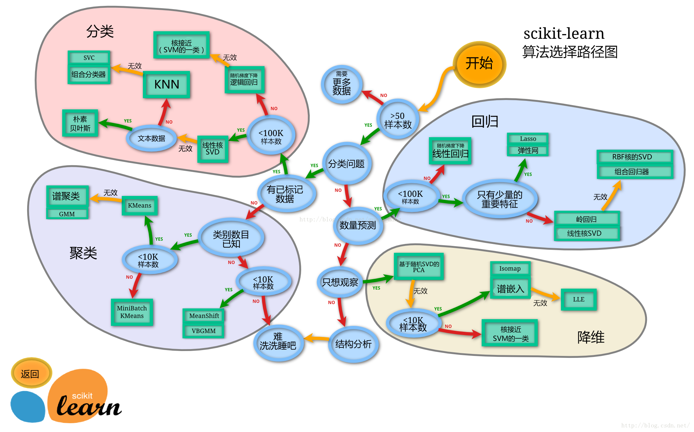
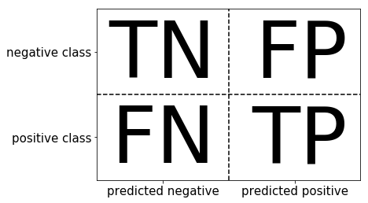
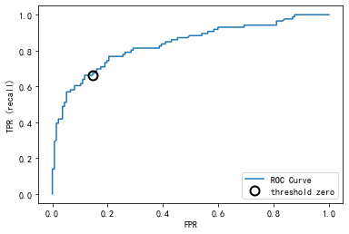

# 第三章(PART1)：模型搭建
```
经过前面的探索性数据分析我们可以很清楚的了解到数据集的情况，以及得出了一些结论。下面我们将搭建一个预测模型，运用机器学习的方式来为泰坦尼克船只做一个预测，我们在测试集的数据中来预测哪些乘客将会存活，哪些乘客将遭遇不幸。然后我们会对我们的模型做一个评价。这一章的内容可以学习到数据建模以及模型评价的知识，算是进阶的内容，为之后的数据分析课程打下基础
```


```python
import pandas as pd
import numpy as np
import seaborn as sns
import matplotlib.pyplot as plt
import os
os.chdir("D:\datasets\hands-on-data-analysis\第三章项目集合")
from IPython.display import Image
%matplotlib inline
```


```python
plt.rcParams['font.sans-serif'] = ['SimHei'] # 用来正常显示中文标签
plt.rcParams['axes.unicode_minus'] = False # 用来正常显示负号
plt.rcParams['figure.figsize'] = (10, 6) # 设置输出图片大小
```


```python
# 读取训练数集
train = pd.read_csv('train.csv')
train.shape
```


    (891, 12)


```python
train.head()
```


<div>
<style scoped>
    .dataframe tbody tr th:only-of-type {
        vertical-align: middle;
    }

    .dataframe tbody tr th {
        vertical-align: top;
    }

    .dataframe thead th {
        text-align: right;
    }
</style>
<table border="1" class="dataframe">
  <thead>
    <tr style="text-align: right;">
      <th></th>
      <th>PassengerId</th>
      <th>Survived</th>
      <th>Pclass</th>
      <th>Name</th>
      <th>Sex</th>
      <th>Age</th>
      <th>SibSp</th>
      <th>Parch</th>
      <th>Ticket</th>
      <th>Fare</th>
      <th>Cabin</th>
      <th>Embarked</th>
    </tr>
  </thead>
  <tbody>
    <tr>
      <th>0</th>
      <td>1</td>
      <td>0</td>
      <td>3</td>
      <td>Braund, Mr. Owen Harris</td>
      <td>male</td>
      <td>22.0</td>
      <td>1</td>
      <td>0</td>
      <td>A/5 21171</td>
      <td>7.2500</td>
      <td>NaN</td>
      <td>S</td>
    </tr>
    <tr>
      <th>1</th>
      <td>2</td>
      <td>1</td>
      <td>1</td>
      <td>Cumings, Mrs. John Bradley (Florence Briggs Th...</td>
      <td>female</td>
      <td>38.0</td>
      <td>1</td>
      <td>0</td>
      <td>PC 17599</td>
      <td>71.2833</td>
      <td>C85</td>
      <td>C</td>
    </tr>
    <tr>
      <th>2</th>
      <td>3</td>
      <td>1</td>
      <td>3</td>
      <td>Heikkinen, Miss. Laina</td>
      <td>female</td>
      <td>26.0</td>
      <td>0</td>
      <td>0</td>
      <td>STON/O2. 3101282</td>
      <td>7.9250</td>
      <td>NaN</td>
      <td>S</td>
    </tr>
    <tr>
      <th>3</th>
      <td>4</td>
      <td>1</td>
      <td>1</td>
      <td>Futrelle, Mrs. Jacques Heath (Lily May Peel)</td>
      <td>female</td>
      <td>35.0</td>
      <td>1</td>
      <td>0</td>
      <td>113803</td>
      <td>53.1000</td>
      <td>C123</td>
      <td>S</td>
    </tr>
    <tr>
      <th>4</th>
      <td>5</td>
      <td>0</td>
      <td>3</td>
      <td>Allen, Mr. William Henry</td>
      <td>male</td>
      <td>35.0</td>
      <td>0</td>
      <td>0</td>
      <td>373450</td>
      <td>8.0500</td>
      <td>NaN</td>
      <td>S</td>
    </tr>
  </tbody>
</table>
</div>


## 特征工程
### 任务一：缺失值填充
```
1. 对分类变量缺失值：填充某个缺失值字符(NA)、用最多类别的进行填充
2. 对连续变量缺失值：填充均值、中位数、众数
```


```python
# 对分类变量进行填充
train['Cabin'] = train['Cabin'].fillna('NA')
train['Embarked'] = train['Embarked'].fillna('S')
# 对连续变量进行填充
train['Age'] = train['Age'].fillna(train['Age'].mean())
# 检查缺失值比例
train.isnull().mean().sort_values(ascending=False)
```


    Embarked       0.0
    Cabin          0.0
    Fare           0.0
    Ticket         0.0
    Parch          0.0
    SibSp          0.0
    Age            0.0
    Sex            0.0
    Name           0.0
    Pclass         0.0
    Survived       0.0
    PassengerId    0.0
    dtype: float64


### 任务二：编码分类变量


```python
# 取出所有的输入特征
data = train[['Pclass','Sex','Age','SibSp','Parch','Fare', 'Embarked']]
# 进行虚拟变量转换
data = pd.get_dummies(data)
data.head()
```


<div>
<style scoped>
    .dataframe tbody tr th:only-of-type {
        vertical-align: middle;
    }

    .dataframe tbody tr th {
        vertical-align: top;
    }

    .dataframe thead th {
        text-align: right;
    }
</style>
<table border="1" class="dataframe">
  <thead>
    <tr style="text-align: right;">
      <th></th>
      <th>Pclass</th>
      <th>Age</th>
      <th>SibSp</th>
      <th>Parch</th>
      <th>Fare</th>
      <th>Sex_female</th>
      <th>Sex_male</th>
      <th>Embarked_C</th>
      <th>Embarked_Q</th>
      <th>Embarked_S</th>
    </tr>
  </thead>
  <tbody>
    <tr>
      <th>0</th>
      <td>3</td>
      <td>22.0</td>
      <td>1</td>
      <td>0</td>
      <td>7.2500</td>
      <td>0</td>
      <td>1</td>
      <td>0</td>
      <td>0</td>
      <td>1</td>
    </tr>
    <tr>
      <th>1</th>
      <td>1</td>
      <td>38.0</td>
      <td>1</td>
      <td>0</td>
      <td>71.2833</td>
      <td>1</td>
      <td>0</td>
      <td>1</td>
      <td>0</td>
      <td>0</td>
    </tr>
    <tr>
      <th>2</th>
      <td>3</td>
      <td>26.0</td>
      <td>0</td>
      <td>0</td>
      <td>7.9250</td>
      <td>1</td>
      <td>0</td>
      <td>0</td>
      <td>0</td>
      <td>1</td>
    </tr>
    <tr>
      <th>3</th>
      <td>1</td>
      <td>35.0</td>
      <td>1</td>
      <td>0</td>
      <td>53.1000</td>
      <td>1</td>
      <td>0</td>
      <td>0</td>
      <td>0</td>
      <td>1</td>
    </tr>
    <tr>
      <th>4</th>
      <td>3</td>
      <td>35.0</td>
      <td>0</td>
      <td>0</td>
      <td>8.0500</td>
      <td>0</td>
      <td>1</td>
      <td>0</td>
      <td>0</td>
      <td>1</td>
    </tr>
  </tbody>
</table>
</div>


## 模型搭建
```
1. 处理完前面的数据我们就得到建模数据，下一步是选择合适模型
2. 在进行模型选择之前我们需要先知道数据集最终是进行监督学习还是无监督学习
3. 除了根据我们任务来选择模型外，还可以根据数据样本量以及特征的稀疏性来决定
4. 刚开始我们总是先尝试使用一个基本的模型来作为其baseline，进而再训练其他模型做对比，最终选择泛化能
力或性能比较好的模型
思考
1. 数据集哪些差异会导致模型在拟合数据是发生变化
```


```python
# sklearn模型算法选择路径图
Image('20170624105439491.png')
```





### 任务一：切割训练集和测试集
```
1. 按比例切割训练集和测试集(一般测试集的比例有30%、25%、20%、15%和10%)
2. 按目标变量分层进行等比切割
3. 设置随机种子以便结果能复现
提示
1. 切割数据集是为了后续能评估模型泛化能力
2. sklearn中切割数据集的方法为 train_test_split
3. 查看函数文档可以在jupyter noteboo里面使用 train_test_split? 后回车即可看到
4. 分层和随机种子在参数里寻找
思考
1. 什么情况下切割数据集的时候不用进行随机选取
```


```python
from sklearn.model_selection import train_test_split
# 一般先取出X和y后再切割，有些情况会使用到未切割的，这时候X和y就可以用
X = data
y = train['Survived']
# 对数据集进行切割
X_train, X_test, y_train, y_test = train_test_split(X, y, stratify=y, random_state=0)
# 查看数据形状
X_train.shape, X_test.shape
```


    ((668, 10), (223, 10))


### 任务二：模型创建
```
1. 创建基于线性模型的分类模型（逻辑回归）
2. 创建基于树的分类模型（决策树、随机森林）
3. 查看模型的参数，并更改参数值，观察模型变化
提示
1. 逻辑回归不是回归模型而是分类模型，不要与 LinearRegression 混淆
2. 随机森林其实是决策树集成为了降低决策树过拟合的情况
3. 线性模型所在的模块为 sklearn.linear_model
4. 树模型所在的模块为 sklearn.ensemble
思考
1. 为什么线性模型可以进行分类任务，背后是怎么的数学关系
2. 对于多分类问题，线性模型是怎么进行分类的
```


```python
from sklearn.linear_model import LogisticRegression
from sklearn.ensemble import RandomForestClassifier
```


```python
# 默认参数逻辑回归模型
lr = LogisticRegression()
lr.fit(X_train, y_train)
```

    C:\Users\Administrator\anaconda3\lib\site-packages\sklearn\linear_model\_logistic.py:762: ConvergenceWarning: lbfgs failed to converge (status=1):
    STOP: TOTAL NO. of ITERATIONS REACHED LIMIT.
    
    Increase the number of iterations (max_iter) or scale the data as shown in:
        https://scikit-learn.org/stable/modules/preprocessing.html
    Please also refer to the documentation for alternative solver options:
        https://scikit-learn.org/stable/modules/linear_model.html#logistic-regression
      n_iter_i = _check_optimize_result(
    


    LogisticRegression()


```python
# 查看训练集和测试集score值
print("Training set score: {:.2f}".format(lr.score(X_train, y_train)))
print("Testing set score: {:.2f}".format(lr.score(X_test, y_test)))
```

    Training set score: 0.80
    Testing set score: 0.78
    


```python
# 调整参数后的逻辑回归模型
lr2 = LogisticRegression(C=100)
lr2.fit(X_train, y_train)
```

    C:\Users\Administrator\anaconda3\lib\site-packages\sklearn\linear_model\_logistic.py:762: ConvergenceWarning: lbfgs failed to converge (status=1):
    STOP: TOTAL NO. of ITERATIONS REACHED LIMIT.
    
    Increase the number of iterations (max_iter) or scale the data as shown in:
        https://scikit-learn.org/stable/modules/preprocessing.html
    Please also refer to the documentation for alternative solver options:
        https://scikit-learn.org/stable/modules/linear_model.html#logistic-regression
      n_iter_i = _check_optimize_result(
    


    LogisticRegression(C=100)


```python
print("Training set score: {:.2f}".format(lr2.score(X_train, y_train)))
print("Testing set score: {:.2f}".format(lr2.score(X_test, y_test)))
```

    Training set score: 0.81
    Testing set score: 0.78
    


```python
# 默认参数的随机森林分类模型
rfc = RandomForestClassifier()
rfc.fit(X_train, y_train)
```


    RandomForestClassifier()


```python
print("Training set score: {:.2f}".format(rfc.score(X_train, y_train)))
print("Testing set score: {:.2f}".format(rfc.score(X_test, y_test)))
```

    Training set score: 0.99
    Testing set score: 0.80
    


```python
# 调整参数后的随机森林分类模型
rfc2 = RandomForestClassifier(n_estimators=100, max_depth=5)
rfc2.fit(X_train, y_train)
```


    RandomForestClassifier(max_depth=5)


```python
print("Training set score: {:.2f}".format(rfc2.score(X_train, y_train)))
print("Testing set score: {:.2f}".format(rfc2.score(X_test, y_test)))
```

    Training set score: 0.85
    Testing set score: 0.83
    

### 任务三：输出模型预测结果
```
1. 输出模型预测分类标签
2. 输出不同分类标签的预测概率
提示
1. 一般监督模型在sklearn里面有个 predict 能输出预测标签， predict_proba 则可以输出标签概率
思考
1. 预测标签的概率对我们有什么帮助
```


```python
# 预测标签
pred = lr.predict(X_train)
# 此时我们可以看到0和1的数组
pred[:10]
```


    array([0, 1, 1, 1, 0, 0, 1, 0, 1, 1], dtype=int64)


```python
# 预测标签概率
pred_proba = lr.predict_proba(X_train)
```


```python
pred_proba[:10]
```


    array([[0.61849688, 0.38150312],
           [0.13850854, 0.86149146],
           [0.46207996, 0.53792004],
           [0.19167839, 0.80832161],
           [0.86645829, 0.13354171],
           [0.9089166 , 0.0910834 ],
           [0.12699322, 0.87300678],
           [0.90464799, 0.09535201],
           [0.04934005, 0.95065995],
           [0.12648265, 0.87351735]])


# 第三章(PART2)：模型评估
## 模型评估
```
1. 模型评估是为了知道模型的泛化能力。
2. 交叉验证（cross-validation）是一种评估泛化性能的统计学方法，它比单次划分训练集和测试集的方法更加稳
定、全面。
3. 在交叉验证中，数据被多次划分，并且需要训练多个模型。
4. 最常用的交叉验证是 k 折交叉验证（k-fold cross-validation），其中 k 是由用户指定的数字，通常取 5 或 10。
5. 准确率（precision）度量的是被预测为正例的样本中有多少是真正的正例
6. 召回率（recall）度量的是正类样本中有多少被预测为正类
7. f-分数是准确率与召回率的调和平均
```

### 任务一：交叉验证
```
1. 用10折交叉验证来评估逻辑回归模型
2. 计算交叉验证精度的平均值
```


```python
Image('Snipaste_2020-01-05_16-37-56.png')
```


```
提示
1. 交叉验证在sklearn中的模块为 sklearn.model_selection
思考
1. k折越多的情况下会带来什么样的影响？
```


```python
from sklearn.model_selection import cross_val_score
```


```python
lr = LogisticRegression(C=100)
scores = cross_val_score(lr, X_train, y_train, cv=10)
```

    C:\Users\Administrator\anaconda3\lib\site-packages\sklearn\linear_model\_logistic.py:762: ConvergenceWarning: lbfgs failed to converge (status=1):
    STOP: TOTAL NO. of ITERATIONS REACHED LIMIT.
    
    Increase the number of iterations (max_iter) or scale the data as shown in:
        https://scikit-learn.org/stable/modules/preprocessing.html
    Please also refer to the documentation for alternative solver options:
        https://scikit-learn.org/stable/modules/linear_model.html#logistic-regression
      n_iter_i = _check_optimize_result(
    C:\Users\Administrator\anaconda3\lib\site-packages\sklearn\linear_model\_logistic.py:762: ConvergenceWarning: lbfgs failed to converge (status=1):
    STOP: TOTAL NO. of ITERATIONS REACHED LIMIT.
    
    Increase the number of iterations (max_iter) or scale the data as shown in:
        https://scikit-learn.org/stable/modules/preprocessing.html
    Please also refer to the documentation for alternative solver options:
        https://scikit-learn.org/stable/modules/linear_model.html#logistic-regression
      n_iter_i = _check_optimize_result(
    C:\Users\Administrator\anaconda3\lib\site-packages\sklearn\linear_model\_logistic.py:762: ConvergenceWarning: lbfgs failed to converge (status=1):
    STOP: TOTAL NO. of ITERATIONS REACHED LIMIT.
    
    Increase the number of iterations (max_iter) or scale the data as shown in:
        https://scikit-learn.org/stable/modules/preprocessing.html
    Please also refer to the documentation for alternative solver options:
        https://scikit-learn.org/stable/modules/linear_model.html#logistic-regression
      n_iter_i = _check_optimize_result(
    C:\Users\Administrator\anaconda3\lib\site-packages\sklearn\linear_model\_logistic.py:762: ConvergenceWarning: lbfgs failed to converge (status=1):
    STOP: TOTAL NO. of ITERATIONS REACHED LIMIT.
    
    Increase the number of iterations (max_iter) or scale the data as shown in:
        https://scikit-learn.org/stable/modules/preprocessing.html
    Please also refer to the documentation for alternative solver options:
        https://scikit-learn.org/stable/modules/linear_model.html#logistic-regression
      n_iter_i = _check_optimize_result(
    C:\Users\Administrator\anaconda3\lib\site-packages\sklearn\linear_model\_logistic.py:762: ConvergenceWarning: lbfgs failed to converge (status=1):
    STOP: TOTAL NO. of ITERATIONS REACHED LIMIT.
    
    Increase the number of iterations (max_iter) or scale the data as shown in:
        https://scikit-learn.org/stable/modules/preprocessing.html
    Please also refer to the documentation for alternative solver options:
        https://scikit-learn.org/stable/modules/linear_model.html#logistic-regression
      n_iter_i = _check_optimize_result(
    C:\Users\Administrator\anaconda3\lib\site-packages\sklearn\linear_model\_logistic.py:762: ConvergenceWarning: lbfgs failed to converge (status=1):
    STOP: TOTAL NO. of ITERATIONS REACHED LIMIT.
    
    Increase the number of iterations (max_iter) or scale the data as shown in:
        https://scikit-learn.org/stable/modules/preprocessing.html
    Please also refer to the documentation for alternative solver options:
        https://scikit-learn.org/stable/modules/linear_model.html#logistic-regression
      n_iter_i = _check_optimize_result(
    C:\Users\Administrator\anaconda3\lib\site-packages\sklearn\linear_model\_logistic.py:762: ConvergenceWarning: lbfgs failed to converge (status=1):
    STOP: TOTAL NO. of ITERATIONS REACHED LIMIT.
    
    Increase the number of iterations (max_iter) or scale the data as shown in:
        https://scikit-learn.org/stable/modules/preprocessing.html
    Please also refer to the documentation for alternative solver options:
        https://scikit-learn.org/stable/modules/linear_model.html#logistic-regression
      n_iter_i = _check_optimize_result(
    C:\Users\Administrator\anaconda3\lib\site-packages\sklearn\linear_model\_logistic.py:762: ConvergenceWarning: lbfgs failed to converge (status=1):
    STOP: TOTAL NO. of ITERATIONS REACHED LIMIT.
    
    Increase the number of iterations (max_iter) or scale the data as shown in:
        https://scikit-learn.org/stable/modules/preprocessing.html
    Please also refer to the documentation for alternative solver options:
        https://scikit-learn.org/stable/modules/linear_model.html#logistic-regression
      n_iter_i = _check_optimize_result(
    C:\Users\Administrator\anaconda3\lib\site-packages\sklearn\linear_model\_logistic.py:762: ConvergenceWarning: lbfgs failed to converge (status=1):
    STOP: TOTAL NO. of ITERATIONS REACHED LIMIT.
    
    Increase the number of iterations (max_iter) or scale the data as shown in:
        https://scikit-learn.org/stable/modules/preprocessing.html
    Please also refer to the documentation for alternative solver options:
        https://scikit-learn.org/stable/modules/linear_model.html#logistic-regression
      n_iter_i = _check_optimize_result(
    


```python
# k折交叉验证分数
scores
```


    array([0.82089552, 0.7761194 , 0.82089552, 0.79104478, 0.85074627,
           0.86567164, 0.73134328, 0.86567164, 0.75757576, 0.6969697 ])


```python
# 平均交叉验证分数
print("Average cross-validation score: {:.2f}".format(scores.mean()))
```

    Average cross-validation score: 0.80
    

### 任务二：混淆矩阵
```
1. 计算二分类问题的混淆矩阵
2. 计算精确率、召回率以及f-分数
```


```python
Image('Snipaste_2020-01-05_16-38-26.png')
```





```python
Image('Snipaste_2020-01-05_16-39-27.png')
```


```
提示
1. 混淆矩阵的方法在sklearn中的 sklearn.metrics 模块
2. 混淆矩阵需要输入真实标签和预测标签
思考
1. 如果自己实现混淆矩阵的时候该注意什么问题
```


```python
from sklearn.metrics import confusion_matrix
```


```python
# 训练模型
lr = LogisticRegression(C=100)
lr.fit(X_train, y_train)
```

    C:\Users\Administrator\anaconda3\lib\site-packages\sklearn\linear_model\_logistic.py:762: ConvergenceWarning: lbfgs failed to converge (status=1):
    STOP: TOTAL NO. of ITERATIONS REACHED LIMIT.
    
    Increase the number of iterations (max_iter) or scale the data as shown in:
        https://scikit-learn.org/stable/modules/preprocessing.html
    Please also refer to the documentation for alternative solver options:
        https://scikit-learn.org/stable/modules/linear_model.html#logistic-regression
      n_iter_i = _check_optimize_result(
    


    LogisticRegression(C=100)


```python
# 模型预测结果
pred = lr.predict(X_train)
# 混淆矩阵
confusion_matrix(y_train, pred)
```


    array([[354,  58],
           [ 72, 184]], dtype=int64)


```python
from sklearn.metrics import classification_report
# 精确率、召回率以及f1-score
print(classification_report(y_train, pred))
```

                  precision    recall  f1-score   support
    
               0       0.83      0.86      0.84       412
               1       0.76      0.72      0.74       256
    
        accuracy                           0.81       668
       macro avg       0.80      0.79      0.79       668
    weighted avg       0.80      0.81      0.80       668
    
    

### 任务三：ROC曲线
```
1. 绘制ROC曲线
提示
1. ROC曲线在sklearn中的模块为 sklearn.metrics
2. ROC曲线下面所包围的面积越大越好
思考
1. 对于多分类问题如何绘制ROC曲线
```


```python
from sklearn.metrics import roc_curve
fpr, tpr, thresholds = roc_curve(y_test, lr.decision_function(X_test))
plt.plot(fpr, tpr, label="ROC Curve")
plt.xlabel("FPR")
plt.ylabel("TPR (recall)")
# 找到最接近于0的阈值
close_zero = np.argmin(np.abs(thresholds))
plt.plot(fpr[close_zero], tpr[close_zero], 'o', markersize=10, label="threshold zero", 
fillstyle="none", c='k', mew=2)
plt.legend(loc=4)
```


    <matplotlib.legend.Legend at 0x27998767640>





```python

```
